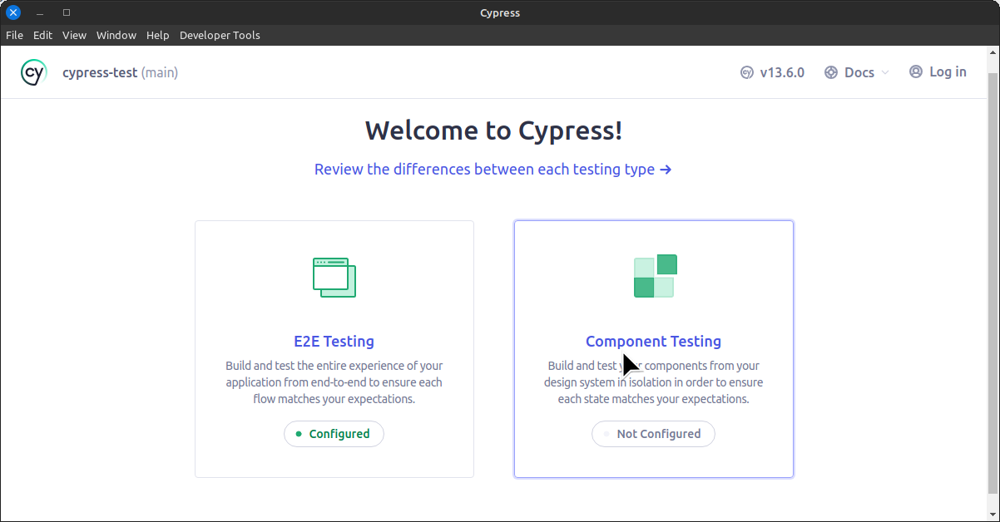

# Usage

This project was built using <code>npm v10.2.4</code> and <code>node v21.2.0</code>.

The repo has a **package.json** file to handle dependencies and modules. Setting up the project should be straight-forward, install all dependencies and run cypress:

## 1. Install dependencies (depends on npm, of course)

~~~
npm install 
~~~

+ Cypress v13.6.0 should be installed in this step.

## 2. Run the test suites

~~~
npm run test
~~~

The custom command should handle all the Cypress initialization tasks and start the application, from there just select any spec file and run the tests.

## Cypress project

The test suite was designed as an 'E2E project'. This approach was chosen because it closely resembles the context on which the tests take place = somewhere between System Testing and E2E testing, the code is already in production and we can validate real use cases, e.g testing features FROM the user's perspective.

It has already been configured, when prompted, select <code>E2E Testing</code> and afterwards, select your browser of choice and <code>Start E2E Testing</code>. I personally use Chrome as a default.

There's two spec files: 
+ login contains tests for login and 'Recruitment' page actions, as per [the login guidelines](./README.md#login-and-navigation-test)
+ page nav and api contains test for navigation and API testing, as per [the navigation guidelines](./README.md#inter-page-navigation-and-api-interaction-test)

